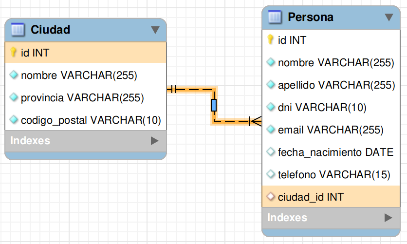

# ¿Qué hay en esta aplicación?

En esta aplicación de ejemplo se encuentra un CRUD de MySQL en Python.

Al ejecutar **crud.py** se mostrará un menu de opciones.

Antes crear una base de datos llamada "**nacidos**" y cargar el script "**nacidos.sql**" que se encuentra dentro de la carpeta sql.

Agregar en **baseDeDatos.py** los datos de la conexión que tengan a mysql (usuario, clave y nombre de base de datos).

Más información sobre Python y MySQL: [https://www.w3schools.com/python/python_mysql_getstarted.asp](https://www.w3schools.com/python/python_mysql_getstarted.asp)

#### ¿Qué necesito instalar?

Además de ya tener instalado Python y MySQL, deberán instalar el driver de MySQL para Python.

Para instalar el driver deben ejecutar por linea de comandos:

**python -m pip install mysql-connector-python**

---

Diagrama Crow Foot de la aplicación de ejemplo:

